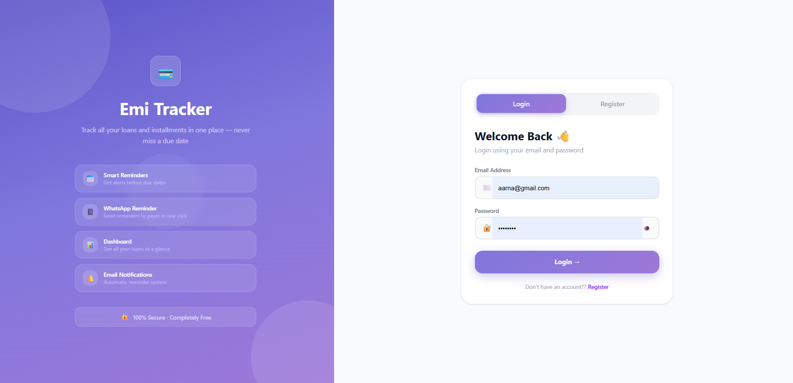
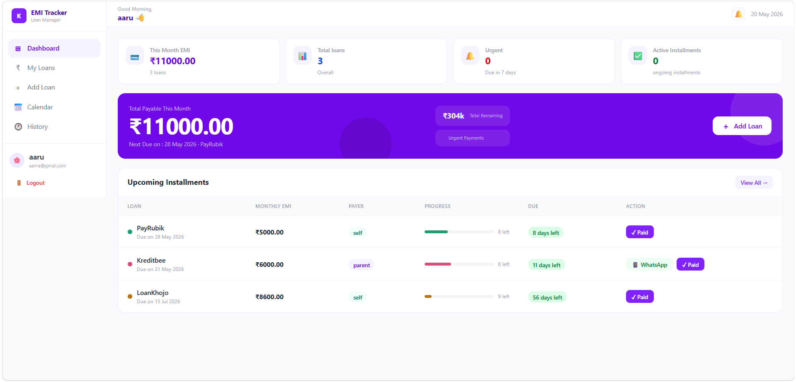
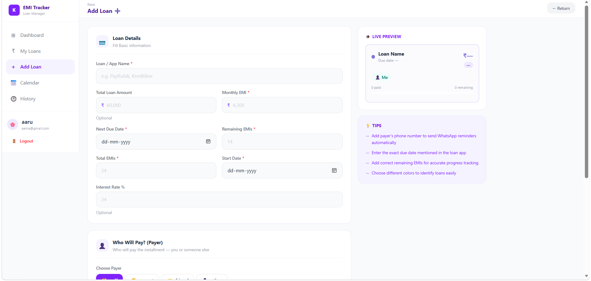
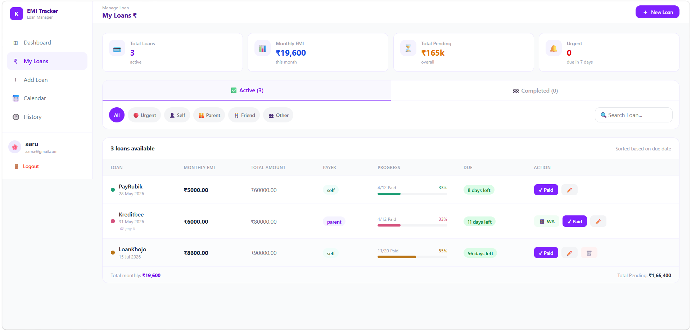
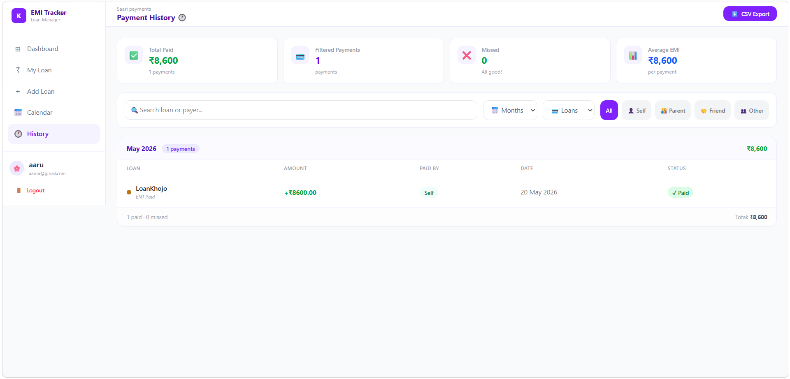

# 💜 EMI Tracker App (Full Stack)

A modern **Full Stack EMI & Loan Management Web Application** that helps users manage their **loans, EMIs, payment history, due dates, and reminders** with a clean dashboard UI and smart tracking system.

---

## ✨ Features

* ➕ Add & Manage Multiple Loans
* 💳 EMI Tracking System
* 📅 Due Date Management
* 🕐 Payment History Page
* 📱 WhatsApp Reminder Integration
* 👤 Payer Management (Self / Parent / Friend / Other)
* 📊 Dashboard with Loan Overview
* 🎨 Colorful Loan Cards
* 📱 Fully Responsive UI
* 🔐 JWT Authentication System
* 📂 CSV Export Feature
* ⚡ REST API Integration
* 🔎 Search & Filter Payments
* 📌 Notes & Loan Details Support

---

## 🛠️ Tech Stack

### Frontend

* Next.js
* React.js
* TypeScript
* Tailwind CSS
* TanStack Query
* SweetAlert2

### Backend

* Node.js
* Express.js
* REST API

### Database

* MySQL

### Authentication

* JWT (JSON Web Token)

---

## 📸 Screenshots

### 🔐 Login Page



### 🏠 Dashboard



### ➕ Add Loan Page



### 💳 My Loans



### 🕐 Payment History



### 📅 EMI Calendar


---

## 🚀 Main Functionalities

### 💳 Loan Management

* Add new loans easily
* Store EMI details
* Track remaining EMIs
* Monitor due dates

### 👤 Payer System

Users can assign EMI payer as:

* Self
* Parent
* Friend
* Other

### 📊 Smart Dashboard

* Total paid EMIs
* Missed payments
* Monthly overview
* Average EMI stats

### 🕐 Payment History

* Filter by month
* Filter by payer
* Search loan history
* Export payment records in CSV

---

## 🔄 Project Flow

1. User Signup / Login
2. JWT Authentication
3. Redirect to Dashboard
4. Add Loan Details
5. Store Data in MySQL Database
6. Track EMI Payments
7. View Payment History
8. Export Reports
9. Logout Securely

---

## 📂 Folder Structure

```bash
loan-tracker/
│
├── frontend/
│   ├── app/
│   ├── components/
│   ├── utils/
│
├── backend/
│   ├── routes/
│   ├── controllers/
│   ├── middleware/
│   ├── config/
│
└── README.md
```

---

## ⚙️ Installation

### Clone Repository

```bash
git clone https://github.com/Himanshi8790-Sharma/EMI-Tracker.git
```

### Install Frontend

```bash
cd frontend
npm install
npm run dev
```

### Install Backend

```bash
cd backend
npm install
npm start
```

---

## 🌸 Future Improvements

* 🔔 EMI Reminder Notifications
* 📧 Email Reminder System
* 📈 Advanced Analytics
* 🌙 Dark Mode
* ☁️ Cloud Deployment

---

## 👩‍💻 Developed By

**Himanshi Sharma** 💜

* GitHub: https://github.com/Himanshi8790-Sharma
* LinkedIn: https://www.linkedin.com/in/himanshi-sharma-414b2a35b

---

## ⭐ If you like this project

Give this repository a ⭐ on GitHub and support the project 🚀💜
