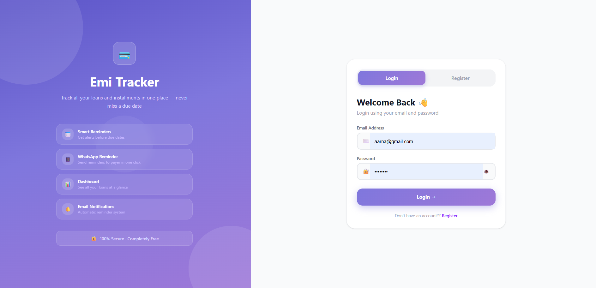
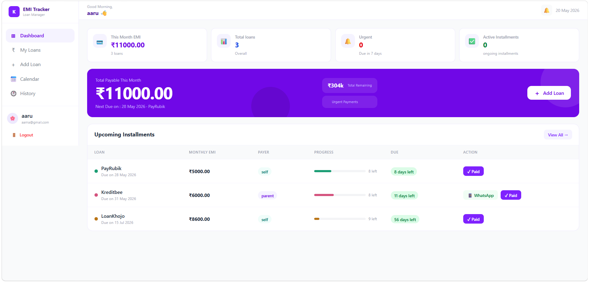
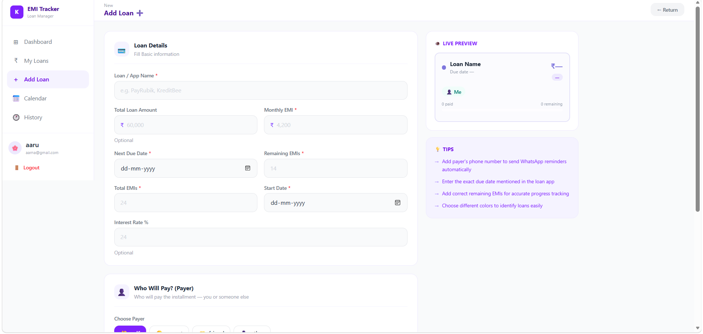
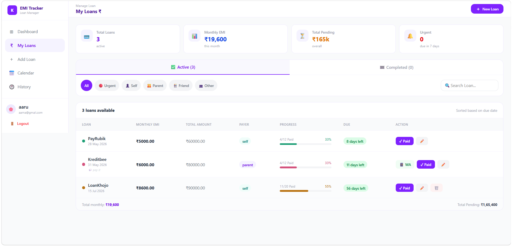
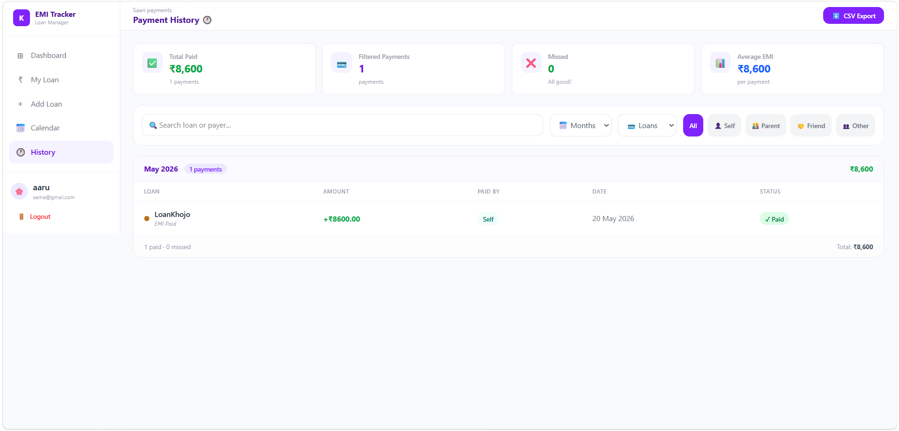
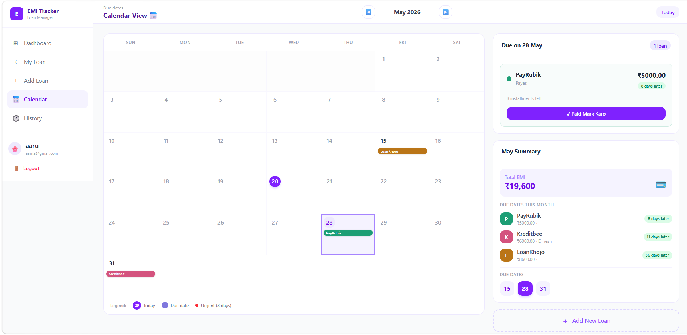

# 💜 EMI Tracker App — Full Stack

A modern **Full Stack EMI & Loan Management Web Application** designed to help users manage loans, EMIs, payment history, due dates, and reminders through a clean and responsive dashboard.

## 🌐 Live Demo

[🚀 View Live Demo](https://emi-tracker-omega.vercel.app/)

> Note: Production MySQL database configuration is pending. The application is fully deployed and ready for database connection.

---

## ✨ Features

- ➕ Add and manage multiple loans
- 💳 EMI tracking system
- 📅 EMI due-date management
- 🕐 Payment history
- 📱 WhatsApp reminder integration
- 👤 Payer management
  - Self
  - Parent
  - Friend
  - Other
- 📊 Dashboard with loan overview
- 🎨 Color-coded loan cards
- 📱 Fully responsive UI
- 🔐 JWT authentication
- 📂 CSV export
- ⚡ REST API integration
- 🔎 Search and filter payments
- 📝 Notes and loan details
- 📅 EMI calendar

---

## 🛠️ Tech Stack

### Frontend

- React.js
- Vite
- TypeScript
- Tailwind CSS
- TanStack Query
- SweetAlert2
- Axios

### Backend

- Node.js
- Express.js
- REST API
- JWT Authentication
- bcrypt

### Database

- MySQL
- mysql2

### Development Tools

- Git
- GitHub
- Vercel
- VS Code

---

## 📸 Screenshots

### 🔐 Login Page



### 🏠 Dashboard



### ➕ Add Loan



### 💳 My Loans



### 🕐 Payment History



### 📅 EMI Calendar



---

## 🚀 Main Functionalities

### 💳 Loan Management

Users can:

- Add new loans
- Store loan and EMI details
- Track remaining EMIs
- Monitor upcoming due dates
- View active and completed loans

### 👤 Payer Management

Each loan can be associated with:

- Self
- Parent
- Friend
- Other

Additional payer information such as name, phone number, and email can also be stored.

### 📊 Dashboard

The dashboard provides an overview of:

- Total loans
- EMI information
- Upcoming EMIs
- Payment status
- Loan details

### 🕐 Payment History

Users can:

- View EMI payment records
- Search payment history
- Filter records
- Filter by payer
- Export payment data as CSV

### 📱 WhatsApp Reminder

The application provides WhatsApp reminder functionality for EMI-related communication.

### 📅 EMI Calendar

Users can view upcoming EMI due dates through the calendar interface.

---

## 🔐 Authentication

The application uses **JWT-based authentication** for secure user login and protected API access.

Authentication flow:

1. User Signup / Login
2. Server validates credentials
3. JWT token is generated
4. Token is used for authenticated API requests
5. Protected pages and API routes are accessed using authentication

---

## 🔄 Project Flow

```text
User Signup / Login
        ↓
JWT Authentication
        ↓
Dashboard
        ↓
Add Loan
        ↓
Loan & EMI Data
        ↓
MySQL Database
        ↓
Track EMI Payments
        ↓
Payment History
        ↓
Reports / CSV Export
        ↓
EMI Reminders
